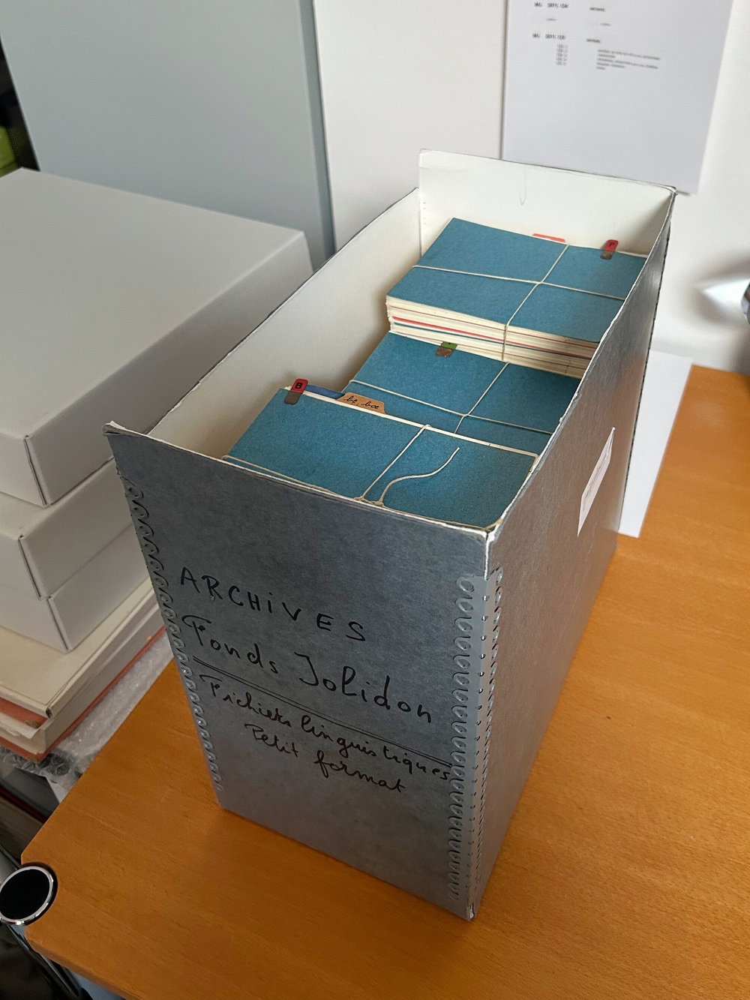
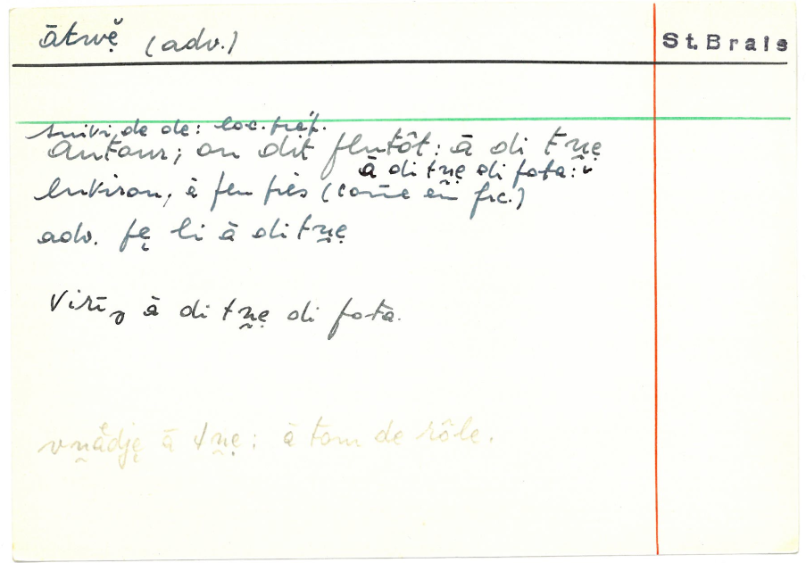
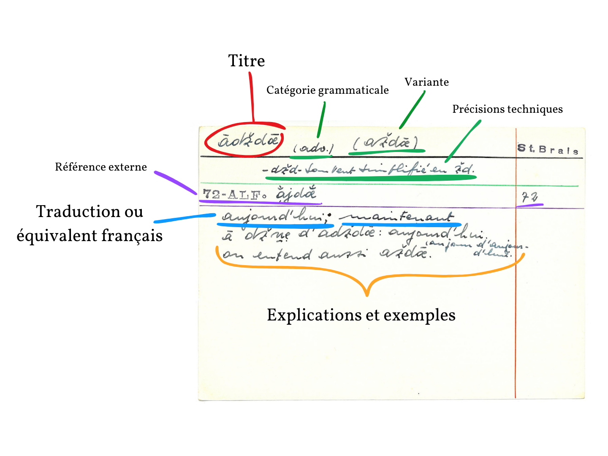
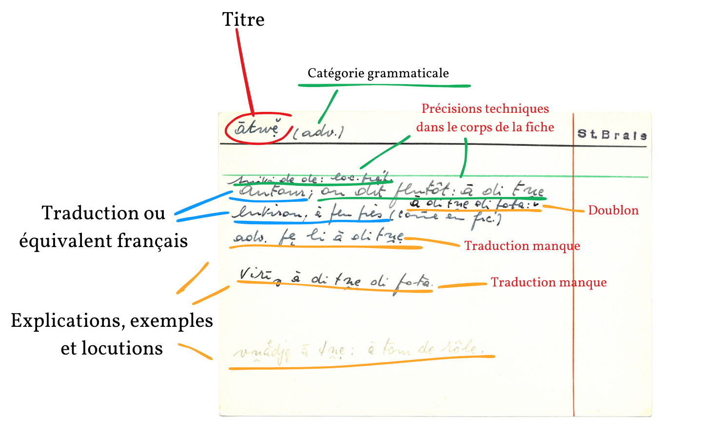

# Édition XML-TEI du *Glossaire de Saint-Brais* de Robert Jolidon
## Le document
Le *glossaire de Saint-Brais* est l'un des travaux majeurs du dialectologue [Robert Jolidon](https://diju.ch/f/notices/detail/1004040-jolidon-robert). Entre 1946 et 1950, celui-ci recueilli le lexique de son village natal sur plusieurs milliers de fiches papier. Il s'agit du seul ouvrage de ce genre concernant le patois jurassien, unique représentant de la langue d'oïl en Suisse.

Malheureusement, Robert Jolidon décède subitement en 1953. Son glossaire, destiné à être imprimé en un volume, est resté sous la forme d'un fichier manuscrit:
|||
|---|---|---|
|Le carton contenant l'entièreté du fichier|Un des paquets de fiches|Une des fiches|

## Les fiches

Voici la structure typique d'une fiche:

Malheureusement, toutes les fiches ne sont pas aussi stéréotypées. Par exemple:

## Enjeux d'un balisage structuré

En l'état actuel, une telle source est absolument inaccessible, pour les raisons suivantes

1. **Document manuscrit et inachevé**

De nombreuses fiches demandent des **ajouts** ou des **suppressions**. Un bon balisage permet de conserver la version originale et la version éditée.

2. **Structure complexe pas toujours régulière**

Les éléments doivent être reclassés et réordonnés.

3. **Pas d'index ou de renvois**

Les différents éléments doivent être balisés pour pouvoir faire l'objet de recherches ou d'autres opérations plus complexes.

4. **Graphie phonétique réservée aux initiés**

Le patois (en graphie phonétique) doit être séparément balisé du français, pour réserver à terme la possibilité d'une conversion automatique de la graphie.

## Éléments à baliser

### Modules TEI utilisés
- *TEI Lite* 
- *Dictionaries*
- Quelques éléments de *Transcr* (module de transcription des sources primaires)

### Éléments utilisés

**Structure** :
- `<div1 type="alpha" xml:id="a-b">` : paquet alphabétique de fiches
	- `<entry xml:id="lemme" facs="facsimile.jpg">` : entrée = fiche = **mot traité**[^1].
		- `<form xml:lang="patois">` : forme du mot en patois = **titre**.
			- Quid du déterminant qui est souvent inclus? Peut-être avec `<colloc>` dans `<usg>` cf. [documentation](https://www.tei-c.org/release/doc/tei-p5-doc/en/html/DI.html#DITPUS).
		- `<gramGrp>` : **informations grammaticales**.
			- `<pos>` : catégorie grammaticale.
			- `<gen>` : genre.
			- `<number>` : nombre.
			- etc.
		- `<usg>` : informations sur l'usage = **remarques et précisions techniques** (j'espère que je peux l'utiliser comme ça, sinon on fera avec `lbl` i guess?)
		- `<cit>` : citations ALF
			- `<quote>` : forme ALF. Pertinent? On pourrait n'inclure que le renvoi vers Cartodialect.
			- Format de la source?
		- `<etym>` : étymologie.
		- `<sense>` : tout ce qui touche à la **traduction**, **définition** et **exemples** du mot.
			- `<def>` : définition ou équivalent français.
			- Quid des exemples? La documentation demande techniquement d'utiliser `<cit>` mais ça n'a ici que peu de sens puisqu'il ne s'agit pas de citation d'un ouvrage externe. 
				- `<q xml:lang="patois">` : citation "libre" (non-sourcée)?
		- `<re>` : sous-entrée (par exemple dérivé, composé)

**Utilisables à plusieurs niveaux** :
- `<xr>` : renvoi vers une autre entrée.
- `<note>` : une annotation diverse ne rentrant dans aucune des catégorie précédente.
- `<oRef/>` : abréviation dans le corps de texte du mot dont il est question (typographiquement rendu par **~**)

À voir
- `<gram>` : indication grammaticale (générique).
- `<lbl>` : pertinent?

[^1]: L'ID des entrées correspond au lemme, en français quand il existe, sous une forme patoise normalisée le reste du temps. J'essayerai au maximum de reprendre les titres du [Glossaire des patois de la Suisse romande](https://portail-gpsr.unine.ch/). Cela facilite l'identification unique des mots, et le renvoi vers cet ouvrage qui fait référence. Comme celui-ci n'est pas encore entièrement publié, je devrai compter sur la collaboration avec cette institution si l'édition du glossaire de Saint-Brais voit le jour.

### Éléments éditoriaux

|Élément|Balise TEI|Attribut|Remarque|
|---|---|---|---|
|Ajouts|`supplied`|`reason="editorial"`|Par exemple traductions
|Suppressions|`gap`|`reason="editorial"`|Par exemple doublons, annotations ultérieures
|Corrections|`corr`|`cert` (niveau de certitude), `resp` (ID de l'éditeur-ice responsable de la correction)|Réservé aux lapsus évidents
